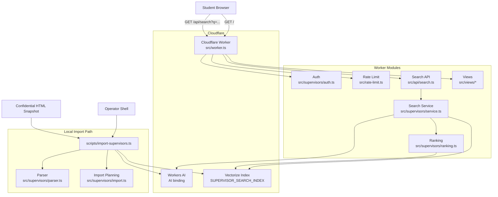

# Application Architecture

This document explains how the `supervisor-search` application is assembled at a system level.

It complements:

- `ARCHITECTURE.md` for repo-wide rules and documentation conventions
- `specs/supervisor-search/spec.md` for feature behavior and guardrails
- `docs/adrs/ADR-014-use-local-import-and-hybrid-vector-reranking.md` for the key storage and retrieval decision

## Summary

The application has two main runtime paths:

1. A Cloudflare Worker that serves the protected search UI and search API.
2. A local operator import script that parses a confidential HTML snapshot and syncs supervisors into Cloudflare Vectorize.

At query time, the Worker either:

- uses sample data for local/test mode, or
- expands aliases, creates an embedding with Workers AI, retrieves candidates from Vectorize, and reranks them in Worker code.

## System Diagram

## Runtime Flow

### 1. Worker Entry

`src/worker.ts` is the only deployed entrypoint.

It routes:

- `GET /` to the search page
- `GET /styles.css` to generated CSS
- `GET /app.js` to the browser search script
- `GET /api/search` to the JSON search endpoint
- `GET /api/health` to a minimal health response

Before protected routes run, the Worker enforces:

- shared Basic Auth in `src/supervisors/auth.ts`
- per-client search throttling in `src/rate-limit.ts`
- restrictive response headers and CSP via `src/views/shared.ts`

### 2. Search Request Path

`GET /api/search?q=...` flows through these modules:

1. `src/api/search.ts` validates the query length and shapes the JSON response.
2. `src/supervisors/service.ts` expands aliases and chooses the data path.
3. In sample mode, results come from `src/supervisors/sample-data.ts`.
4. In live mode:
   - Workers AI creates a query embedding.
   - Vectorize returns candidate matches with metadata.
   - `src/supervisors/ranking.ts` reranks candidates with explicit weighted signals.

The current ranking signals are:

- vector similarity
- topic overlap
- supervisor availability

## Import Flow

The deployed Worker does not ingest confidential source data.

Imports happen locally through `scripts/import-supervisors.ts`:

1. Read a confidential HTML snapshot from disk.
2. Parse supervisors with `src/supervisors/parser.ts`.
3. Validate import safety with `src/supervisors/import.ts`.
4. Create embeddings through Workers AI.
5. Upsert current supervisors into Vectorize.
6. Delete stale Vectorize ids if the safety guardrails allow it.

This keeps confidential source HTML outside the public app surface.

## Data Model

The durable supervisor record shape lives in `src/supervisors/types.ts` as `SupervisorRecord`.

The main stored fields are:

- `supervisorId`
- `name`
- `topicArea`
- `activeThesisCount`
- `searchText`
- `sourceFingerprint`
- `importedAt`

Vectorize metadata uses this record shape directly so the Worker can render results without a second database.

## Key Configuration

### Worker Bindings

Defined through `wrangler.jsonc`:

- `AI` for Workers AI embeddings
- `SUPERVISOR_SEARCH_INDEX` for Vectorize
- `SUPERVISOR_SEARCH_EMBEDDING_MODEL` for the default embedding model id

### Runtime Secrets And Controls

Expected at runtime:

- `SUPERVISOR_SEARCH_BASIC_AUTH_USERNAME`
- `SUPERVISOR_SEARCH_BASIC_AUTH_PASSWORD`
- `SUPERVISOR_SEARCH_RATE_LIMIT_MAX_REQUESTS`
- `SUPERVISOR_SEARCH_RATE_LIMIT_WINDOW_MS`
- `SUPERVISOR_SEARCH_USE_SAMPLE_DATA`

### Import Environment

Expected for the local import script:

- `CLOUDFLARE_ACCOUNT_ID`
- `CLOUDFLARE_API_TOKEN`
- `SUPERVISOR_SEARCH_INDEX_NAME`
- optional `SUPERVISOR_SEARCH_EMBEDDING_MODEL`

## Code Layout

The source tree is split by responsibility:

- `src/api/` for JSON endpoints
- `src/views/` for HTML, CSS, JS response helpers, and page rendering
- `src/supervisors/` for auth, aliases, parsing, ranking, sample data, import logic, and search service code
- `scripts/` for local operator workflows such as imports

## Intended Boundaries

The current architecture intentionally avoids:

- uploading confidential HTML through the Worker
- adding a second persistence layer such as D1 or KV for supervisor metadata
- embedding ranking logic directly in route handlers

Those constraints come from the current spec and ADR set and should only change with explicit documentation updates.
